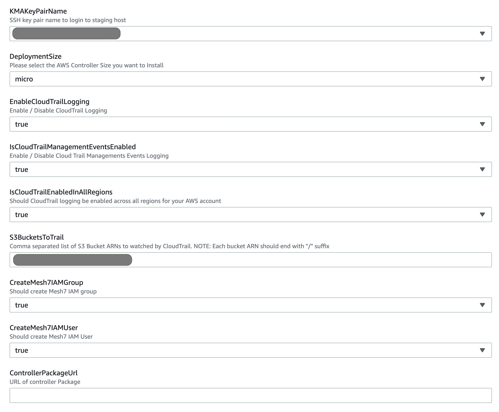

# Mesh7 Cloud-Native Application Behavior Security for AWS

- [Topology](#Topology)
- [Pre-Install](#Pre-Install)
- [Install](#Install)
- [Post-Install](#Post-Install)

## Topology

**Mesh7 Cloud-Native Application Behavior Security for AWS**


Mesh7 provides real-time Layer7 observability to AWS. Mesh7 provides brings contextualized security observability for applications running on AWS.

Mesh7 is installed seamlessly using AWS CloudFormation template. The template installs Mesh7 Contoller in a independent VPC, so that it is isolated from the application workloads both in terms of networking and resources. This provides a clear and non-instrusive plug-and-play scheme.

An Adaptor EC2 instance is started in the User's application VPC. This EC2 instance acts as an adaptor between the application workloads and Mesh7 controller.

Traffic from the application workloads are copied to Mesh7 Adaptor EC2 instance through AWS VPC Traffic Mirroring service. This provides a non-intrusive, out-of-band, zero latency framework for Mesh7 to analyze workload traffic. Mesh7 Adaptor analyzes the traffic within the application VPC. It only communicates the metadata about the traffic to Mesh7 controller. So the application traffic never leaves the confines of application VPC, thus ensuring the intergrity of the application environment.

Mesh7 secures application's S3 buckets by observability into S3 accesses from workloads in application VPC and from external sources.

## Pre-Install
#### 1. Subscription to AWS Marketplace Mesh7 Cloud-Native Application Behavior Security BYOL offering
Please ensure that you have a valid subscription to Mesh7 BYOL offering on AWS Marketplace.

#### 2. Reach out Mesh7 support to get Mesh7 License
Please send an email to Mesh7 Support at aws-support@mesh7.com to obtain Mesh7 License.

## Install

#### 1. Download Mesh7 CloudFormation template

#### 2. Create CloudFormation Stack

######   a. Navigate to Stacks under CloudFormation Pane, and click on ‘Create Stack’

######   b. Upload controller-kma-install-cft.yaml template to create a CloudFormation Stack, and click ‘Next’.

######   c. Give the stack a name, and enter the requested input parameters




######   d. Agree to create an IAM user and resources, and Click ‘Create Stack’

######   e. Get installation data after Stack completes successfully

## Post Install

#### Login to Mesh7 Controller

##### a. Get IP of Mesh7 Adaptor EC2 instance


##### b. Get domain name of Mesh7 Controller UI

Execute the following commmand to get the domain name of Mesh7 Controller UI:

```
NOTE: 
    Replace <your-pem> with PEM file provided to CloudFormation Stack create. eg: foo.pem      
    Replace <mesh7-adaptor-ip> with IP of the Mesh7 Adaptor EC2 instance printed in the CloudFormation Stack output.
```
```

PEM=<your-pem>;MESH7_ADAPTOR_EC2_IP=<mesh7-adaptor-ip>; ssh -i $PEM ubuntu@$MESH7_ADAPTOR_EC2_IP kubectl get svc -n mesh7-system mesh7-nginx-ingress-controller -o jsonpath='{.status.loadBalancer.ingress[].hostname}'; echo

```


##### c. Login to Mesh7 Controller UI using domain name from previous step


